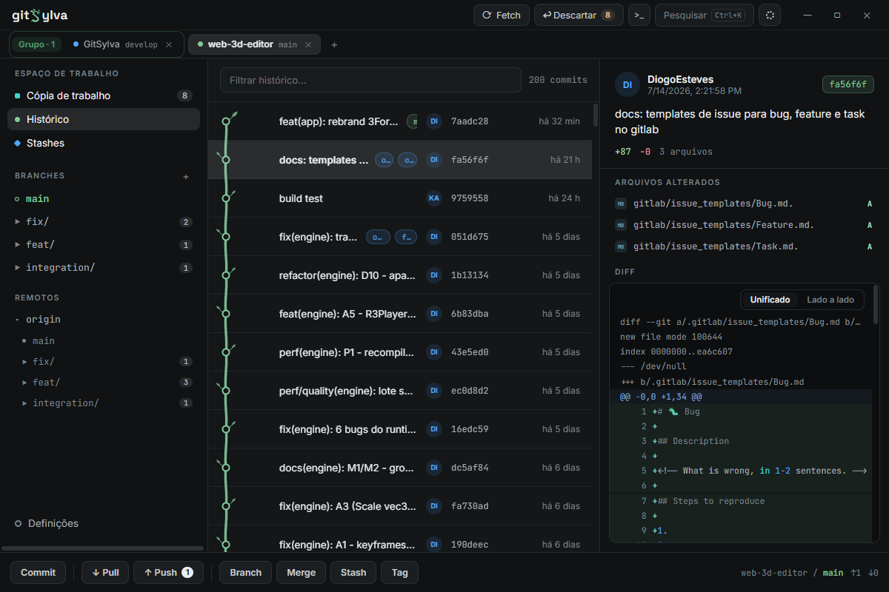

<p align="center">
  
</p>

# GitSylva

**A git client where your history grows like a tree.**

GitSylva is a fast, animated desktop git client for Windows. The commit graph is drawn as a living tree with oak leaves, cherry blossoms, palm trees, or plain classic nodes if that's your thing, on top of a full-featured, keyboard-friendly git workflow.



## Download

Grab the installer from the [latest release](https://github.com/Diogo1306/GitSylva/releases/latest) (`GitSylva_x.y.z_x64-setup.exe`).

- Windows 10/11 x64. WebView2 is installed automatically if missing.
- The app checks for updates on startup and installs them in one click (releases are cryptographically signed).

## Features

- **Living history**: the commit graph grows as an animated tree, with four visual styles and recolorable branch palettes. Virtualized rendering keeps 2,000+ commit histories smooth.
- **Working copy**: stage and unstage per file or per hunk, unified or side-by-side diffs, blame view, per-file-type icons, huge diffs paginated and capped so nothing ever freezes.
- **Branches, stashes, tags**: slashed branch names (`feature/x`) group into collapsible folders, stashes preview their files, merge/rebase/cherry-pick with a persistent conflict banner.
- **Multi-repository**: tabs across the top or a VS Code-style rail, with color-coded, renamable repo groups.
- **Themes**: dark, light, nipon and git-classic; tree styles, branch palettes, accent colors and fonts, all exportable to a JSON file.
- **Command palette**: `Ctrl+K` searches commits, branches, files, repositories and git actions in one place. Every shortcut is rebindable.
- **Stability first**: all git operations run off the UI thread with per-repo write locking, crash/panic capture to a local log, and release-build telemetry (`window.__gsPerf()`).

The UI is currently in Portuguese; full English localization is on the roadmap.

## Development

Prerequisites: [Node.js](https://nodejs.org) 20+, [Rust](https://rustup.rs) (stable), and the [Tauri 2 Windows toolchain](https://v2.tauri.app/start/prerequisites/).

```bash
npm install
npx tauri dev          # run the app with hot reload
```

Checks:

```bash
npx tsc --noEmit       # typecheck
npx eslint src         # lint
npx vitest run         # frontend tests
cargo test             # Rust tests (from src-tauri/)
```

Release build (the updater signs every bundle, so the private key must be loaded; the script handles it):

```powershell
powershell -File scripts/build-installer.ps1
```

For a quick local binary without the installer/signing step:

```bash
npx tauri build --no-bundle   # exe at src-tauri/target/release/app.exe
```

Performance harness (mocked 2,000-commit repo, dev only):

```bash
VITE_PERF_MOCK=1 npm run build && npm run preview
```

## Tech stack

- [Tauri 2](https://v2.tauri.app): Rust backend shelling out to the system `git`, no libgit2
- [React 19](https://react.dev) + TypeScript + [Vite](https://vite.dev)
- [zustand](https://github.com/pmndrs/zustand) for state, [TanStack Query](https://tanstack.com/query) for git data
- Hand-rolled SVG commit graph, no chart library

## Project notes

Design specs live in `docs/design/` and the full audit/engineering log in `docs/GITSYLVA_FINAL_AUDIT.md` (in Portuguese). Runtime logs are written to `%LOCALAPPDATA%\com.gitsylva.app\logs\gitsylva.log`.
